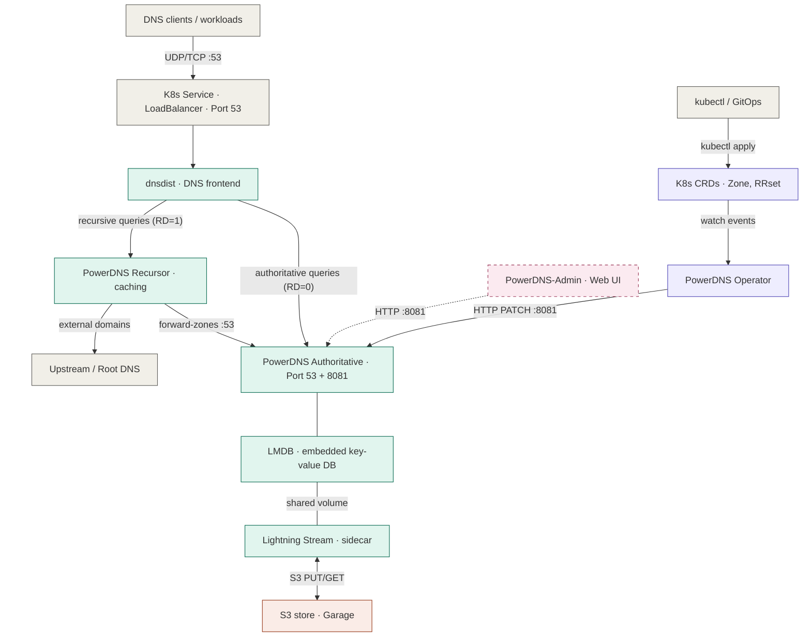
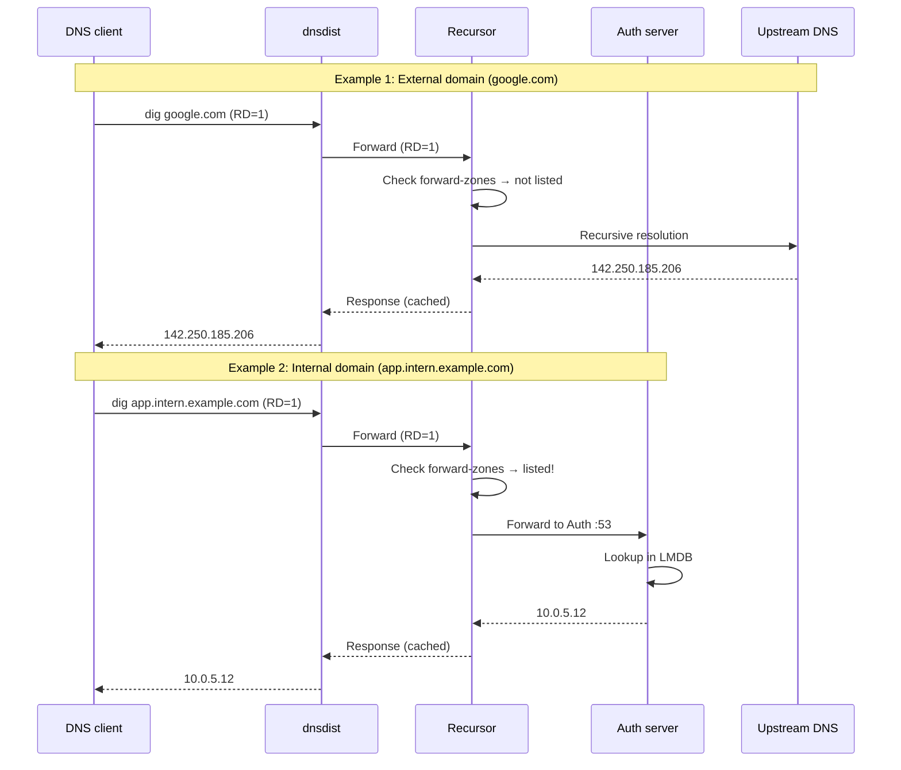
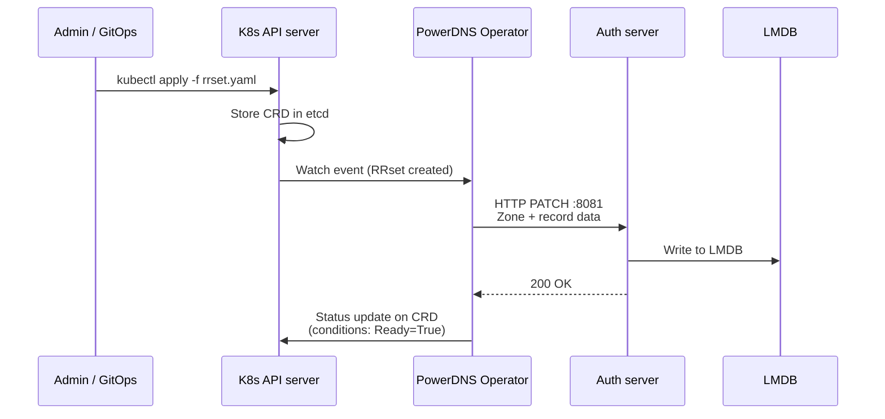
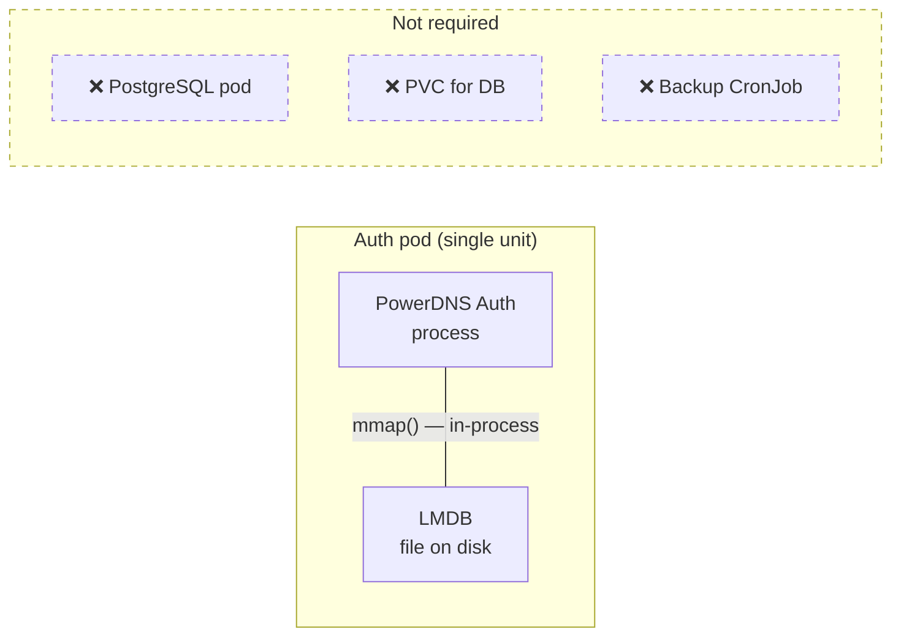
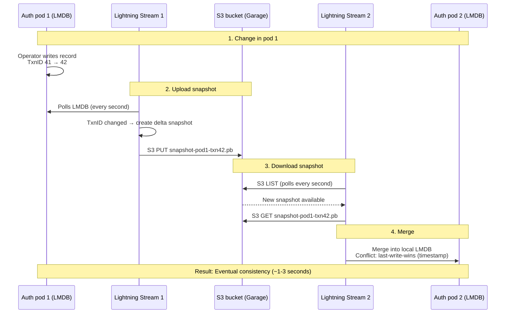
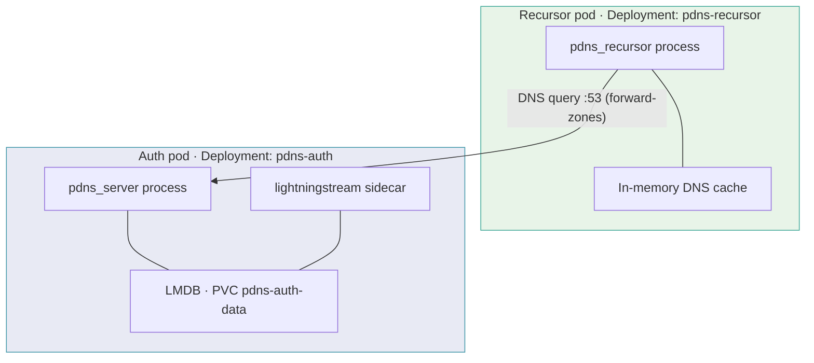

# Architecture: Software-defined DNS on Kubernetes

> **Status:** Active  
> **Last updated:** 2026-07-01

## Contents

1. [System Context and Scope](#1-system-context-and-scope)
2. [System Overview](#2-system-overview)
3. [Component Description](#3-component-description)
   1. [dnsdist — DNS frontend](#31-dnsdist--dns-frontend)
   2. [PowerDNS Recursor — Caching resolver](#32-powerdns-recursor--caching-resolver)
   3. [PowerDNS Authoritative Server — Authoritative zones](#33-powerdns-authoritative-server--authoritative-zones)
   4. [LMDB — Embedded data storage](#34-lmdb--embedded-data-storage)
   5. [Lightning Stream — Replication](#35-lightning-stream--replication)
   6. [S3-compatible object store (Garage)](#36-s3-compatible-object-store-garage)
   7. [PowerDNS Operator — CRD reconciler](#37-powerdns-operator--crd-reconciler)
   8. [PowerDNS-Admin — Web UI](#38-powerdns-admin--web-ui)
4. [Component Interaction](#4-component-interaction)
   1. [DNS resolution (data plane)](#41-dns-resolution-data-plane)
   2. [Configuration change (control plane)](#42-configuration-change-control-plane)
5. [Data Storage Concept (LMDB)](#5-data-storage-concept-lmdb)
   1. [LMDB configuration reference](#51-lmdb-configuration-reference)
   2. [Storage, permissions, and recovery](#52-storage-permissions-and-recovery)
6. [Replication and Backup (Lightning Stream + S3)](#6-replication-and-backup-lightning-stream--s3)
   1. [Sync mechanism](#61-sync-mechanism)
   2. [Consistency model](#62-consistency-model)
   3. [When is the S3 store needed?](#63-when-is-the-s3-store-needed)
7. [Configuration Flow (Operator + CRDs)](#7-configuration-flow-operator--crds)
   1. [Supported CRDs](#71-supported-crds)
   2. [Example: Creating a zone and record](#72-example-creating-a-zone-and-record)
   3. [What the Operator does NOT configure](#73-what-the-operator-does-not-configure)
8. [Cross-Cutting Concepts](#8-cross-cutting-concepts)
   1. [Observability](#81-observability)
   2. [Security and Hardening](#82-security-and-hardening)
   3. [Rolling Updates](#83-rolling-updates)
   4. [Air-Gap Operation](#84-air-gap-operation)
   5. [Network Exposure](#85-network-exposure)
   6. [Architectural Separation: Recursor / Authoritative](#86-architectural-separation-recursor--authoritative)
   7. [Kubernetes Health Probes](#87-kubernetes-health-probes)
9. [OSS Component Overview](#9-oss-component-overview)
10. [Custom Work vs. OSS](#10-custom-work-vs-oss)
11. [Architecture Decision Records](#11-architecture-decision-records)
12. [Delivery Milestones](#12-delivery-milestones)

---

## 1 System Context and Scope

This solution provides a Software-Defined DNS platform packaged as an [OCM (Open Component Model)](https://ocm.software/) component. It targets resource-constrained, decentralized Kubernetes deployment scenarios, must be operable in air-gapped environments, and exposes a fully Kubernetes-native configuration interface via Custom Resources (CRs). The solution is designed for integration into the Open Defense Cloud platform.

**Key constraints:**

| Constraint | Rationale |
|---|---|
| Kubernetes as sole target platform | Mandatory; no alternative deployment models |
| OCM as package format | Mandatory; required by target platform |
| KRO (Kubernetes Resource Operator) | Mandatory; required by target platform |
| Vanilla Kubernetes | No proprietary cluster extensions assumed |
| Air-gap capability | Operation without internet access at runtime |
| OSS building blocks only | No custom development without prior agreement |
| CI/CD portability | Pipelines must run on customer's GitHub (Open Defense Cloud) |

**Stakeholders:**

| Stakeholder | Concern |
|---|---|
| DNS Users | Reliable resolution of local and external domains |
| API Users | DNS configuration management via Kubernetes CRDs |
| Platform / Operations Team | Simple instantiation via KRO + OCM, observability |
| Security Officer | Hardening, CVE-free state, regulatory compliance |
| Client | Acceptance per milestone plan, reproducible CI/CD |

**Quality goals:**

| Priority | Quality Goal | Strategy |
|---|---|---|
| 1 | **Correctness / Compliance** | Strict technical separation of Recursor and Authoritative Server (separate Deployments, no shared storage); see [ADR-001](ADR-001-POWERDNS-COMPONENT-FAMILY.md) |
| 2 | **Resource Efficiency** | Lightweight embedded data store (LMDB); no external DB server; see [ADR-002](ADR-002-LMDB-DATA-STORE.md) |
| 3 | **Usability** | Declarative configuration via Kubernetes Custom Resources; Operator-driven reconciliation; see [ADR-005](ADR-005-OPERATOR-CONFIGURATION-PATH.md) |
| 4 | **Maintainability** | OCM-native versioning and upgrades; documented update paths; see [ADR-004](ADR-004-OCM-KRO-PACKAGING.md) |
| 5 | **Observability** | Native Prometheus-compatible metrics from all components |
| 6 | **Security** | Baseline hardening, CVE scans, air-gap capability, documented residual risks |

---

## 2 System Overview

The solution consists of six core building blocks, bundled as an OCM package and instantiated on Kubernetes via KRO. All building blocks are existing open-source components — no DNS software is developed from scratch.



**Legend**

| Color | Meaning |
|---|---|
| Green | DNS components (OSS) |
| Purple | Operator + CRDs (OSS) |
| Orange | S3 storage (Garage) |
| Gray | Infrastructure / tooling |
| Pink (dashed) | Admin Web UI — optional, to be included if provided by the selected DNS solution |

---

## 3 Component Description

### 3.1 dnsdist — DNS frontend

| | |
|---|---|
| **Function** | Central entry point for all DNS queries. Receives queries on port 53 and distributes them to backend pools (Recursor and Authoritative). |
| **OSS project** | [PowerDNS/pdns](https://github.com/PowerDNS/pdns) — `dnsdist` binary |
| **Container image** | `powerdns/dnsdist-19` |
| **Configuration** | Lua file via ConfigMap — no CRDs, static configuration |
| **AFO reference** | AFO-001 |

**Configuration example:**

```lua
-- Pool for the Recursor
newServer({address=os.getenv("PDNS_RECURSOR_SERVICE_HOST") .. ":53", pool="recursor"})
-- Pool for the Authoritative
newServer({address=os.getenv("PDNS_AUTH_SERVICE_HOST") .. ":53", pool="auth"})
-- RD flag set → Recursor (normal case)
addAction(RDRule(), PoolAction("recursor"))
-- Everything else → directly to Auth
addAction(AllRule(), PoolAction("auth"))
```

> **Note:** In normal operation, dnsdist forwards **all** queries to the Recursor, because clients virtually always set the RD flag. The actual routing decision (internal vs. external domain) is made by the Recursor based on its `forward-zones` configuration. dnsdist is still required for load balancing, rate limiting, DDoS protection, and health checks.

**Additional functions:** Rate limiting, DDoS protection, health checks on backends, optional DoT/DoH termination.

### 3.2 PowerDNS Recursor — Caching resolver

| | |
|---|---|
| **Function** | Resolves external domains recursively and caches results. Forwards queries for local domains to the Authoritative Server via `forward-zones` configuration. |
| **OSS project** | [PowerDNS/pdns](https://github.com/PowerDNS/pdns) — `pdns-recursor` binary |
| **Container image** | `powerdns/pdns-recursor-52` |
| **Configuration** | `recursor.conf` via ConfigMap |
| **AFO reference** | AFO-002 |

**Core configuration — connection to the Authoritative:**

```ini
forward-zones=intern.example.com=__PDNS_AUTH_SERVICE_HOST__:53
forward-zones+=example.local=__PDNS_AUTH_SERVICE_HOST__:53
```

At container startup, the Recursor entrypoint replaces `__PDNS_AUTH_SERVICE_HOST__` with the Kubernetes Service IP from `PDNS_AUTH_SERVICE_HOST`. For forward zones, the Recursor makes a standard DNS query on port 53 to the Auth service — the same protocol as for external domains, just to a different target.

### 3.3 PowerDNS Authoritative Server — Authoritative zones

| | |
|---|---|
| **Function** | Holds and answers queries for own DNS zones. Does not perform recursion. |
| **OSS project** | [PowerDNS/pdns](https://github.com/PowerDNS/pdns) — `pdns` binary with LMDB backend |
| **Container image** | `powerdns/pdns-auth-49` |
| **Ports** | `:53` (DNS queries), `:8081` (HTTP management API) |
| **AFO reference** | AFO-003, AFO-004 |

**Two separate network endpoints:**

- **Port 53 (UDP/TCP):** DNS queries from the Recursor (forward-zones) and from dnsdist (direct authoritative queries).
- **Port 8081 (HTTP):** Management API for zone/record CRUD. Primarily used by the Operator. If a web UI is used concurrently, an appropriate operational concept must prevent state drift (see [ADR-005](ADR-005-OPERATOR-CONFIGURATION-PATH.md)).

### 3.4 LMDB — Embedded data storage

| | |
|---|---|
| **Function** | Key-value database directly within the Auth process. No separate server, no network port. |
| **Technology** | Lightning Memory-Mapped Database (C library, linked into PowerDNS) |
| **Storage location** | `/var/lib/powerdns/pdns.lmdb` and `/var/lib/powerdns/pdns.lmdb-0` in the Auth pod PVC |
| **AFO reference** | AFO-005 |

For the decision rationale and evaluated alternatives, see [ADR-002](ADR-002-LMDB-DATA-STORE.md).
PowerDNS Authoritative and the Lightning Stream sidecar run with the same UID/GID and the same 1000 MB LMDB map size so both processes can safely open the shared LMDB environment.

### 3.5 Lightning Stream — Replication

| | |
|---|---|
| **Function** | Synchronizes LMDB databases between Auth instances via S3 snapshots. Multi-writer, eventual consistency. |
| **OSS project** | [PowerDNS/lightningstream](https://github.com/PowerDNS/lightningstream) |
| **Deployment** | Sidecar container alongside each Auth pod |
| **AFO reference** | AFO-006 |

For details on the sync mechanism, see [Section 6](#6-replication-and-backup-lightning-stream--s3).

### 3.6 S3-compatible object store (Garage)

| | |
|---|---|
| **Function** | Transport medium for Lightning Stream snapshots. |
| **Selected component** | [Garage](https://garagehq.deuxfleurs.fr/) (Rust, AGPLv3) |
| **AFO reference** | AFO-006 |

For the decision rationale (evaluation of alternatives including MinIO), see [ADR-003](ADR-003-LIGHTNINGSTREAM-MINIO-REPLICATION.md).

### 3.7 PowerDNS Operator — CRD reconciler

| | |
|---|---|
| **Function** | Watches Kubernetes CRDs and synchronizes them via HTTP against the Auth API on port 8081. |
| **OSS project** | [powerdns-operator/PowerDNS-Operator](https://github.com/powerdns-operator/PowerDNS-Operator) |
| **CRDs** | `Zone`, `ClusterZone`, `RRset`, `ClusterRRset` |
| **AFO reference** | AFO-009, AFO-010, AFO-011, AFO-012 |

**Important constraints:**

- The Operator manages the Authoritative Server exclusively. Recursor and dnsdist are configured separately via ConfigMap.
- The Operator only reconciles on Kubernetes events. It does not periodically check for drift between CRDs and PowerDNS.
- A separate Operator instance is required per Auth server instance.

See [ADR-005](ADR-005-OPERATOR-CONFIGURATION-PATH.md) for the rationale for using the Operator as the primary configuration path.

### 3.8 PowerDNS-Admin — Web UI

| | |
|---|---|
| **Function** | Web interface for zone/record management, DNSSEC, user management. |
| **Status** | Optional — to be included if the selected DNS solution provides a web UI. |
| **OSS projects** | [PowerDNS-Admin](https://github.com/PowerDNS-Admin/PowerDNS-Admin) (legacy) or [pda-next](https://github.com/PowerDNS-Admin/pda-next) (successor, not yet production-ready) |

**Conflict risk:** Both the Admin UI and the Operator access port 8081 of the Auth server without awareness of each other. If a web UI is integrated, an appropriate operational concept must govern concurrent access (see [ADR-005](ADR-005-OPERATOR-CONFIGURATION-PATH.md)).

#### No architectural blocker

A web UI is **optional and deferred**. The architecture does **not** preclude later integration — it would be purely additive, with no change to existing components:

- **API contract already exposed.** The Authoritative Server serves the management HTTP API on port 8081 with `X-API-Key` authentication via the `pdns-auth` Service — the exact interface a web UI consumes.
- **Packaging slot reserved.** The OCM Component Descriptor carries a named, commented-out slot for the web UI image, and the air-gap localization configuration supports adding the corresponding image mapping.
- **Optional-component pattern proven.** The deployment blueprint already gates optional resources on a schema flag (the multi-instance object store is included only when `multiInstance` is set). A web UI follows the same pattern — an `enableWebUI` flag guarding an additional Deployment, Service, and ConfigMap.

#### Operational concept (concurrent access)

Because the Operator and a web UI would both write to the same Auth API and the Operator reconciles only on Kubernetes events (no periodic drift detection), an integration must govern concurrent access (see [ADR-005](ADR-005-OPERATOR-CONFIGURATION-PATH.md)): treat the CRD/Operator path as authoritative and run the UI **read-only**, or permit writes only under **temporal separation** from Operator-managed changes.

Installation and configuration of a web UI — image bundling, the `enableWebUI` flag, configuration, network policy, and external access — are documented in [WEBUI.md](WEBUI.md). Actual integration is out of scope here and requires a separate change request.

---

## 4 Component Interaction

### 4.1 DNS resolution (data plane)



### 4.2 Configuration change (control plane)



---

## 5 Data Storage Concept (LMDB)

The specification requires "stateless-optimized" data storage. This does not mean that no data is stored, but rather that **no external stateful dependencies** are introduced. LMDB achieves this goal:



| Property | LMDB | PostgreSQL |
|---|---|---|
| Separate process | No (linked in) | Yes (own pod) |
| Network latency per lookup | 0 ms (in-process) | 0.5–2 ms (TCP) |
| Additional RAM | ~0 MB (uses OS page cache) | 100–300 MB (shared_buffers etc.) |
| PersistentVolumeClaim | Optional (emptyDir possible) | Required |
| Air-gap effort | No additional image | Additional image + init |
| Lightning Stream compatibility | Native (from Auth 4.8) | Not supported |

For the decision rationale and evaluated alternatives, see [ADR-002](ADR-002-LMDB-DATA-STORE.md).

### 5.1 LMDB configuration reference

The Authoritative Server enables the LMDB backend through `pdns.conf`
(`deploy/base/authoritative/configmap.yaml`). The settings below are the ones
relevant to operating and tuning the data store:

| Setting | Value | Purpose |
|---|---|---|
| `launch` | `lmdb` | Selects the LMDB backend for the Authoritative Server. |
| `lmdb-filename` | `/var/lib/powerdns/pdns.lmdb` | Path to the LMDB environment file on the persistent volume. |
| `lmdb-lightning-stream` | `yes` | Enables the on-disk layout required by the Lightning Stream sidecar. PowerDNS 4.9 removed the previous `mapasync` sync mode. |
| `lmdb-shards` | `1` | Single shard is mandatory when `lmdb-lightning-stream=yes`. |
| `lmdb-map-size` | `1000` (MB) | Maximum size of the LMDB environment. **Must match** the Lightning Stream `map_size` (see below) so both processes can open the same environment. |

The Lightning Stream sidecar
(`deploy/base/authoritative/configmap-lightningstream.yaml`) opens the same two
LMDB files and must use an identical map size:

| Setting | Value | Purpose |
|---|---|---|
| `lmdbs.main.path` | `/var/lib/powerdns/pdns.lmdb` | Main LMDB environment, shared with the Auth process. |
| `lmdbs.shard.path` | `/var/lib/powerdns/pdns.lmdb-0` | Shard 0 environment (single shard). |
| `options.map_size` | `1000MB` | Must equal `lmdb-map-size` on the Auth process. |
| `options.no_subdir` | `true` | LMDB stored as a single file, not a directory. |
| `schema_tracks_changes` | `true` | Lets Lightning Stream detect changes via the LMDB schema. |
| `lmdb_poll_interval` | `1s` | How often the sidecar polls the LMDB for changes. |

> **Important:** `lmdb-map-size` (Auth) and `map_size` (Lightning Stream) must
> always be changed together. A mismatch prevents one of the two processes from
> opening the shared environment.

### 5.2 Storage, permissions, and recovery

| Aspect | Configuration |
|---|---|
| **Persistent volume** | `PersistentVolumeClaim` `pdns-auth-data`, `1Gi`, `ReadWriteOnce` (`deploy/base/authoritative/pvc.yaml`). Resize by increasing `resources.requests.storage`; raise `lmdb-map-size`/`map_size` accordingly if zone data grows beyond ~1000 MB. |
| **Mount path** | `/var/lib/powerdns` — holds the LMDB files and the Lightning Stream snapshot directory (`/var/lib/powerdns/snapshots`, single-instance `type: fs`). |
| **File ownership** | The pod runs with `fsGroup: 953`. A `repair-lmdb-permissions` init container runs `chown -R 953:953 /var/lib/powerdns` so the read-only-root-filesystem Auth and sidecar containers can write to the volume. |
| **Restart behaviour** | The Auth Deployment uses the `Recreate` strategy because the `ReadWriteOnce` PVC cannot be mounted by two pods at once (see [§8.3](#83-rolling-updates)). On restart, the new pod re-opens the existing LMDB file from the PVC — no data import is required. |
| **Recovery** | After a pod loss, zone data is restored directly from the LMDB file on the retained PVC. In multi-instance mode, a freshly provisioned instance also rebuilds its LMDB from Lightning Stream snapshots in the S3 store (see [§6](#6-replication-and-backup-lightning-stream--s3)). |

Persistence, recovery, and resource consumption of this configuration are
exercised by `hack/validate-lmdb.sh`.

---

## 6 Replication and Backup (Lightning Stream + S3)

### 6.1 Sync mechanism

Lightning Stream synchronizes LMDB databases between Auth instances without direct pod-to-pod communication. The S3 bucket serves as an asynchronous mailbox.



### 6.2 Consistency model

- **Multi-writer:** Every instance can read and write. No leader/follower.
- **Conflict resolution:** Last-write-wins based on nanosecond timestamps per record.
- **Sync latency:** Typically 1–3 seconds (configurable via `storage_poll_interval` and `lmdb_poll_interval`).
- **Deleted records:** Marked as tombstones (not physically deleted). The tombsweeper cleans them up after a configurable interval.

### 6.3 When is the S3 store needed?

Lightning Stream supports two storage backends:

- **`type: s3`** — Snapshots in S3 bucket. **Only needed for multi-instance operation** (AFO-013).
- **`type: fs`** — Snapshots in local directory (PVC). **Sufficient for single-instance** as backup/recovery.

For edge deployments with a single Auth pod, no S3 store is required. See [ADR-006](ADR-006-S3-FOR-MULTI-INSTANCE.md) for the decision rationale, and [ADR-003](ADR-003-LIGHTNINGSTREAM-MINIO-REPLICATION.md) for the selection of Garage as the S3 store.

### 6.4 Recovery procedure

Three recovery scenarios are relevant; the appropriate path depends on which storage backend is configured.

**Scenario A — Single-instance pod restart, PVC retained (normal case)**

1. The Auth pod is deleted (node eviction, rolling restart, or manual deletion).
2. The `Recreate` Deployment strategy starts a new pod. The `repair-lmdb-permissions` init container runs `chown` so the LMDB files are writable.
3. The Auth process opens the LMDB file on the retained PVC — zone data is immediately available; no import is needed.
4. The lightningstream sidecar resumes uploading snapshots to `/var/lib/powerdns/snapshots` (`type: fs`).

**Scenario B — Single-instance full PVC loss**

1. The PVC is lost (storage provider failure, accidental deletion).
2. A new empty PVC is provisioned. The pod starts with an empty LMDB.
3. lightningstream finds no snapshots in `/var/lib/powerdns/snapshots` — there is nothing to restore.
4. The Operator reconciles all `Zone` and `RRset` custom resources and re-writes zone data to the Auth API. All zone and record data described in CRs is recovered; any data written directly to the Auth API without a corresponding CR is lost.

> Mitigation: keep all DNS configuration in `Zone` / `RRset` CRs so the Operator is the authoritative source. The lightningstream `type: fs` snapshots provide a faster restart path but are not a substitute for CR-based configuration.

**Scenario C — Multi-instance pod restart / new replica provisioned (Garage)**

1. A new Auth pod starts; lightningstream is configured with `type: s3` pointing at the per-instance Garage cluster.
2. On startup, lightningstream downloads the latest LMDB snapshots from the `pdns-lmdb` Garage bucket before the Auth process accepts queries.
3. Zone data is consistent with the state at the time of the last uploaded snapshot (typically 1–3 seconds before the pod was lost).
4. If the new pod is an additional replica (scaling up), it merges snapshots from all existing instances via the shared Garage bucket and becomes consistent within the configured sync interval.

Scenario A and C are exercised automatically by `hack/validate-replication.sh` (single-instance) and `hack/validate-replication.sh --multi-instance` (Garage path).

### 6.5 Operational limits

| Aspect | Value / Guidance |
|---|---|
| **Snapshot retention (`type: fs`)** | Snapshots accumulate indefinitely on the PVC. The default PVC size is 1 Gi; the snapshot directory and LMDB files share that space. Monitor with `kubectl exec … -c lightningstream -- du -sh /var/lib/powerdns/snapshots`. |
| **Snapshot retention (`type: s3`)** | Controlled by lightningstream's `storage_gc_interval` and `storage_gc_generations` settings (not currently set explicitly; upstream defaults apply). Garage storage grows proportionally to write throughput × retention window. |
| **Tombsweeper** | Deleted DNS records are stored as tombstones to ensure convergence across replicas. The tombsweeper removes them after `tombstone_lifetime` (upstream default: 7 days). Do not manually compact or truncate the LMDB — removing tombstones before all replicas have seen them causes deleted records to reappear. |
| **Sync latency** | End-to-end propagation is governed by `lmdb_poll_interval` (how often lightningstream polls for LMDB changes) and `storage_poll_interval` (how often it checks the S3 bucket for new snapshots from peers). Both default to `1s`; reducing below `1s` increases CPU load without meaningful latency benefit. |
| **LMDB map size** | `lmdb-map-size` (Auth `pdns.conf`) and `map_size` (lightningstream config) must always be identical — a mismatch prevents one of the two processes from opening the shared environment. Current default: 1000 MB. Raise both together if `du -sh /var/lib/powerdns/pdns.lmdb` approaches the limit. |
| **Garage layout capacity** | The bootstrap sidecar claims 1 GB of capacity for the single-node layout. If the `pdns-lmdb` bucket approaches this limit, increase the capacity claim in the bootstrap script and apply the new layout via `garage layout apply`. |
| **Garage single-node limitation** | The current Garage deployment uses `rpc_public_addr: 127.0.0.1:3901`, which confines the cluster to a single pod. Horizontal scaling of Garage is not supported in this configuration. Each `PowerDNSInstance` with `multiInstance: true` gets its own single-node Garage cluster; Garage clusters are not shared across instances. |

---

## 7 Configuration Flow (Operator + CRDs)

### 7.1 Supported CRDs

| Custom Resource | Scope | Description |
|---|---|---|
| `ClusterZone` | Cluster-wide | Top-level zone, available in all namespaces |
| `Zone` | Namespace-scoped | Zone with namespace isolation |
| `ClusterRRset` | Cluster-wide | DNS record, globally available |
| `RRset` | Namespace-scoped | DNS record with namespace isolation |

All CRDs expose a `status` section with:

- `status.conditions` — standardized Kubernetes conditions (for example, `Available`).
- `status.syncStatus` — current synchronization state, such as `Succeeded`, `Pending`, or `Failed`.
- PowerDNS metadata for reconciled zones and error details when synchronization fails.

### 7.2 Example: Creating a zone and record

```yaml
# Create zone
apiVersion: dns.cav.enablers.ob/v1alpha2
kind: Zone
metadata:
  name: intern.example.com
  namespace: dns
spec:
  kind: Native
  nameservers:
    - ns1.intern.example.com
    - ns2.intern.example.com
---
# Create A record
apiVersion: dns.cav.enablers.ob/v1alpha2
kind: RRset
metadata:
  name: app.intern.example.com
  namespace: dns
spec:
  name: app.intern.example.com.
  type: A
  ttl: 300
  records:
    - 10.0.5.12
  zoneRef:
    name: intern.example.com
    kind: Zone
```

### 7.3 What the Operator does NOT configure

| Component | Configuration path | Example |
|---|---|---|
| **Authoritative** (zone data) | ✅ CRDs → Operator → API | Zones, records, DNSSEC |
| **Recursor** (forwarding, upstream) | ❌ ConfigMap | `forward-zones`, upstream resolvers |
| **dnsdist** (routing, rate limiting) | ❌ ConfigMap (Lua) | Server pools, rules, health checks |

### 7.4 Multi-instance isolation model

Multi-instance deployments use one KRO `PowerDNSInstance` object per DNS stack. Each instance supplies a target namespace in `spec.namespace`; KRO then creates the runtime objects for that stack in that namespace.

| Isolation boundary | Instance-scoped resources |
|---|---|
| Namespace | One namespace per DNS stack, for example `dns-a` and `dns-b` |
| Configuration | API key Secret, component ConfigMaps, and PowerDNS CRs are namespace-local |
| Workloads | dnsdist, Recursor, Authoritative Server, Garage, and Operator Deployments are namespace-local |
| Network | Services use namespace-local DNS names; each Operator points to its namespace-local Authoritative API |
| Storage | Each instance owns its Authoritative PVC and, in multi-instance mode, its Garage store |
| Cluster-scoped prerequisites | CRDs, the KRO `ResourceGraphDefinition`, the KRO controller itself, and a default `StorageClass` are installed once per cluster (see below) |

#### Cluster-scoped prerequisites

Before the first `PowerDNSInstance` is applied, the target Kubernetes cluster must provide:

- **KRO controller and CRDs.** The reconciler for `kro.run/v1alpha1` must be installed and healthy. On Amazon EKS this is available as a managed capability; on other clusters it can be installed from the upstream KRO release.
- **KRO identity permissions.** The service account (or cloud-provider role) that the KRO controller assumes when reconciling a `PowerDNSInstance` must have cluster-wide permission to create and manage every kind of object the `ResourceGraphDefinition` produces: namespaces, deployments, services, configmaps, secrets, persistent volume claims, service accounts, roles, role bindings, cluster roles, and cluster role bindings, plus the `dns.cav.enablers.ob` CRDs from this bundle. A missing namespace-create grant manifests as the RGD reporting `GraphAccepted=False` and `state: Inactive`.
- **Bundle CRDs.** The PowerDNS Operator CRDs (`zones`, `rrsets`, `clusterzones`, `clusterrrsets`) installed once per cluster.
- **Default `StorageClass`.** The Authoritative Server PVC requires `accessModes: ReadWriteOnce` and works best with `volumeBindingMode: WaitForFirstConsumer` so the volume is created in the same Availability Zone as its pod.
- **Optional cloud load-balancer controller.** Only required if `dnsdist` is exposed as `type: LoadBalancer`. On EKS, the AWS Load Balancer Controller also needs the cluster's private subnets to carry the `kubernetes.io/role/internal-elb=1` tag, otherwise `EnsureLoadBalancer` reports that no matching subnet was found.

These prerequisites are independent of the cloud provider; the EKS-specific examples are concrete realisations rather than part of the contract.

The namespace model keeps Kubernetes objects, credentials, Services, and persistent data separate for each DNS stack. Runtime isolation is validated by creating different zones and records in two instances and checking both the Kubernetes API and the backing Authoritative Server state.

Each instance runs its own PowerDNS Operator deployment, configured with a namespace-local `PDNS_API_URL` and the `WATCH_NAMESPACE` environment variable set to the instance namespace. With `WATCH_NAMESPACE` set, the operator's manager cache is restricted to that namespace, so namespaced `Zone` and `RRset` resources from other namespaces are neither watched nor reconciled. As defense in depth, the per-instance operator `ServiceAccount` is granted only a namespaced `Role` for the namespaced CRDs and operational resources (`zones`, `rrsets`, `events`, `leases`); a minimal `ClusterRole` covers the cluster-scoped `ClusterZone` / `ClusterRRset` CRDs that the operator binary always reconciles. End-to-end configuration and runtime isolation is verified by [`hack/validate-multi-instance.sh`](../hack/validate-multi-instance.sh).

The shipping image
(`ghcr.io/telekom/powerdns-operator:sha-1a1bf0c@sha256:4a096359cac381e8cf4ce947770b58a1b1be1fda59a9f82e3038fa9ea7213fd7`)
is built from the public maintained branch
[`telekom/PowerDNS-Operator:feat/watch-namespace-env`](https://github.com/telekom/PowerDNS-Operator/tree/feat/watch-namespace-env)
at commit
[`1a1bf0c`](https://github.com/telekom/PowerDNS-Operator/commit/1a1bf0c19fc86512cc3b13829e298a99c3aa7d93).
That commit reapplies the `WATCH_NAMESPACE` patch to pinned upstream commit
[`powerdns-operator/PowerDNS-Operator@255d6b0`](https://github.com/powerdns-operator/PowerDNS-Operator/commit/255d6b01372aa94118d2e875553af783fb5062e4).
It is not the plain upstream image; searching the upstream `main` branch alone
for `WATCH_NAMESPACE` therefore finds no matches.
The public
[`1a1bf0c` build workflow](https://github.com/telekom/PowerDNS-Operator/actions/runs/31013044539)
passed generated-code checks, lint, unit tests, PowerDNS 4.9 and 5.0 end-to-end
tests, image scanning, and multi-architecture publishing.
The previously deployed source and pre-refresh feature branch remain
independently verifiable through the
[`archive/watch-namespace-deployed-b23ee7d`](https://github.com/telekom/PowerDNS-Operator/tree/archive/watch-namespace-deployed-b23ee7d)
and
[`archive/watch-namespace-pre-refresh-5c6edda`](https://github.com/telekom/PowerDNS-Operator/tree/archive/watch-namespace-pre-refresh-5c6edda)
tags. Upstream support is tracked in
[powerdns-operator/PowerDNS-Operator#307](https://github.com/powerdns-operator/PowerDNS-Operator/issues/307);
once an upstream release contains the patch, the deployment can switch to the
upstream image.

This capability is independently verifiable without any internal knowledge:

- **Deployed configuration:** [`deploy/base/operator/deployment.yaml`](../deploy/base/operator/deployment.yaml) sets `WATCH_NAMESPACE`; [`deploy/base/operator/rbac.yaml`](../deploy/base/operator/rbac.yaml) grants the matching namespaced `Role` alongside a minimal cluster-scoped `ClusterRole`.
- **Runtime proof:** [`hack/validate-multi-instance.sh`](../hack/validate-multi-instance.sh) provisions two simultaneous instances and asserts cross-namespace isolation with explicit negative RBAC checks (`kubectl auth can-i` denials), in addition to functional zone and record isolation.

Focused validation is implemented in
[`hack/validate-multi-instance.sh`](../hack/validate-multi-instance.sh):

```bash
./hack/validate-multi-instance.sh --cleanup
```

It is also part of
[`hack/validate-cluster.sh`](../hack/validate-cluster.sh), the full cluster
validation suite:

```bash
RUN_MULTI_INSTANCE=true ./hack/validate-cluster.sh --cleanup
```

---

## 8 Cross-Cutting Concepts

### 8.1 Observability

**Primary:** Native Prometheus-compatible metrics exposed by the Recursor,
Authoritative Server, and Operator through namespace-local Kubernetes Services.
Services support annotation-based discovery; an optional Prometheus Operator
overlay provides ServiceMonitors.

Required minimum coverage includes DNS query counts, error rates, latency,
cache behaviour, reconciliation failures, process health, and scrape target
availability. The complete scrape configuration and metric-family catalogue
are documented in [OBSERVABILITY.md](OBSERVABILITY.md).

OpenTelemetry integration is deferred as documented in
[ADR-007](ADR-007-OPENTELEMETRY-INTEGRATION.md). A future collector can ingest
the existing Prometheus endpoints; distributed DNS request tracing requires
separate commissioning.

### 8.2 Security and Hardening

- CVE scans of all container images performed and documented in CI (AFO-020, AFO-021).
- Baseline hardening measures applied: minimized runtime permissions, restrictive network policies where supported by target architecture.
- DNS-specific hardening applied where relevant.
- Residual risks, exceptions, and assumptions documented.
- No claim to formal certification or full STIG/CIS compliance unless explicitly agreed.

> The detailed security review summary, control coverage, and residual risks are documented in the [Operations Manual §6](OPERATIONS.md#6-security-hardening).

### 8.3 Rolling Updates

Rolling update strategies are configured for all Deployments where the component and target architecture permit it. The goal is to minimise DNS query interruption during software updates.

| Component | Strategy | maxSurge | maxUnavailable | Notes |
|---|---|---|---|---|
| dnsdist | `RollingUpdate` | 1 | 0 | New pod ready before old terminates |
| PowerDNS Recursor | `RollingUpdate` | 1 | 0 | New pod ready before old terminates; cache starts cold |
| PowerDNS Authoritative | `Recreate` | — | — | `ReadWriteOnce` PVC prevents concurrent pod mount |
| PowerDNS Operator | `RollingUpdate` | 1 | 0 | Leader election ensures single active reconciler |

**Expected availability impact:**

- **dnsdist / Recursor:** Zero-downtime update expected. `maxUnavailable: 0` ensures the old pod continues serving until the new pod passes its readiness probe (TCPSocket `:53`). The Recursor's in-memory cache is not transferred; a brief cache-miss spike follows each rollout.
- **Authoritative Server:** Brief DNS downtime expected. The `ReadWriteOnce` PVC (`pdns-auth-data`) cannot be mounted by two pods simultaneously, making a concurrent `RollingUpdate` impossible. The `Recreate` strategy terminates the old pod first so the new pod can mount the PVC cleanly. Typical interruption: pod termination + LMDB initialisation + readiness delay (~15–30 s).
- **Operator:** Zero-downtime expected. With `--leader-elect`, the new Operator acquires the controller-runtime lease only after the old instance releases it, preventing dual reconciliation.

**Architectural limits:**

- With `replicas: 1`, all components have a single active pod. `RollingUpdate` with `maxSurge: 1` temporarily doubles pod count; ensure sufficient node capacity before triggering an update.
- CRD schema migrations (when required between versions) must be applied before updating the Operator. No automated CRD migration tooling is provided in this release.

For the full package update and upgrade procedure — versioning strategy, OCM
update steps, CRD migration concept, rollback, and validation — see the
[Update and Upgrade Guide](UPGRADE.md).

### 8.4 Air-Gap Operation

- All container images bundled within the OCM package; no pull from external registries at runtime (AFO-024).
- Image references are configurable to point to a customer-provided private registry.
- Garage and all other infrastructure components included in the OCM package.
- Air-gap deployment procedure documented (AFO-022).

### 8.5 Network Exposure

External DNS access is provided exclusively through the dnsdist Service. All other inter-component communication is cluster-internal; no other component Service is exposed outside the cluster.

**Exposed ports:**

| Service | Port | Protocol | Purpose |
|---|---|---|---|
| dnsdist | 53 | UDP | DNS queries (standard) |
| dnsdist | 53 | TCP | DNS queries (large responses, fallback) |

**Recommended firewall / network rules:**

- Allow inbound UDP/53 and TCP/53 to the dnsdist LoadBalancer address from authorized DNS client networks only.
- Deny all other inbound traffic to the LoadBalancer address.
- All remaining Services (Recursor, Authoritative Server, Operator, Lightning Stream, Garage) use `ClusterIP` and must not be exposed externally.

**Fallback for environments without LoadBalancer support:** If the target environment does not support `type: LoadBalancer` (e.g. bare-metal without MetalLB), override the Service type to `NodePort` or route UDP/TCP via a custom ingress. The Service manifest is a standalone Kustomize resource (`deploy/base/dnsdist/service.yaml`) and can be patched per overlay without modifying the base.

### 8.6 Architectural Separation: Recursor / Authoritative

**Regulatory basis:** Strict functional separation of Recursor and Authoritative Server is mandated by the client's applicable DNS regulations.

**Technical implementation:**

The separation is enforced at the Kubernetes workload level. Each function runs as a distinct Deployment with its own pod, process, configuration, and storage:

| Dimension | Recursor (`pdns-recursor`) | Authoritative Server (`pdns-auth`) |
|---|---|---|
| Kubernetes object | `Deployment` | `Deployment` |
| Process | `pdns_recursor` (caching resolver) | `pdns_server` + LMDB backend |
| ConfigMap | `pdns-recursor-config` | `pdns-auth-config` |
| Persistent storage | None (in-memory cache only) | PVC `pdns-auth-data` (LMDB) |
| Network service | `ClusterIP :53` | `ClusterIP :53`, `:8081` |
| Kubernetes service | `pdns-recursor.dns.svc.cluster.local` | `pdns-auth.dns.svc.cluster.local` |
| Manifest path | `deploy/base/recursor/` | `deploy/base/authoritative/` |

**Isolation diagram:**



The sole permitted inter-component communication path is the standard DNS protocol on port 53 (UDP/TCP). The Recursor has no access to:

- the LMDB data store or PVC of the Auth pod,
- the management API (port 8081) of the Auth server,
- any volume, Secret, or ConfigMap belonging to the Auth Deployment.

**Verification steps:**

| Check | Command | Expected result |
|---|---|---|
| Separate Deployments | `kubectl get deployment -n dns` | `pdns-recursor` and `pdns-auth` listed as distinct objects |
| No shared PVC | `kubectl get pvc -n dns` | Only `pdns-auth-data` present; Recursor pod spec references no PVC |
| Protocol-only interface | Inspect Recursor ConfigMap and startup command | `forward-zones` targets the Auth Service IP on port 53 exclusively (DNS, not API) |
| Process isolation | `kubectl get pods -n dns -o wide` | Recursor and Auth run in separate pods on independent lifecycles |

**Traceability:**

| Artifact | Reference |
|---|---|
| Architecture decision | [ADR-001 — PowerDNS Component Family](ADR-001-POWERDNS-COMPONENT-FAMILY.md) |
| Recursor manifests | `deploy/base/recursor/` |
| Auth manifests | `deploy/base/authoritative/` |

---

### 8.7 Kubernetes Health Probes

Liveness and Readiness Probes are configured for all Deployments where a health endpoint is available. Probes use the minimal check that verifies the component's observable state without requiring authenticated API calls.

| Component | Liveness | Readiness |
|---|---|---|
| dnsdist | TCPSocket `:53` | TCPSocket `:53` |
| PowerDNS Recursor | TCPSocket `:53` | TCPSocket `:53` |
| PowerDNS Authoritative | TCPSocket `:53` | TCPSocket `:8081` (management API port) |
| PowerDNS Operator | HTTPGet `:8081 /healthz` | HTTPGet `:8081 /readyz` |
| Lightning Stream (sidecar) | — | — |

**Rationale:**

- **dnsdist / Recursor:** A listening TCP port 53 is the minimal reachability check. Both components serve DNS over TCP as well as UDP; an open socket confirms the process is operational.
- **Authoritative Server:** Liveness checks the DNS listener (`:53`); readiness checks the management API port (`:8081`), ensuring the Operator can reach the API before traffic is routed.
- **Operator:** Uses the standard controller-runtime health endpoints (`/healthz`, `/readyz`) on the dedicated health port (`:8081`).
- **Lightning Stream:** No health endpoint is exposed by this sidecar. Kubernetes restarts the container on crash without a probe.

**Timing parameters:**

| Parameter | dnsdist / Recursor | Authoritative | Operator |
|---|---|---|---|
| `initialDelaySeconds` | 5 | 10 | 5 (readiness) / 15 (liveness) |
| `periodSeconds` | 10 | 10 | 10 |
| `timeoutSeconds` | 3 | 3 | 3 |
| `failureThreshold` | 3 | 3 | 3 |

The higher initial delay for the Authoritative Server accounts for LMDB initialization. The higher liveness delay for the Operator accommodates leader election startup.

---

## 9 OSS Component Overview

| Component | OSS project | License | Status |
|---|---|---|---|
| dnsdist | [PowerDNS/pdns](https://github.com/PowerDNS/pdns) | GPL-2.0 | Stable, Docker image available |
| Recursor | [PowerDNS/pdns](https://github.com/PowerDNS/pdns) | GPL-2.0 | Stable, Docker image available |
| Authoritative + LMDB | [PowerDNS/pdns](https://github.com/PowerDNS/pdns) | GPL-2.0 | Stable, Docker image available |
| Lightning Stream | [PowerDNS/lightningstream](https://github.com/PowerDNS/lightningstream) | GPL-3.0 | Stable, Docker image available |
| Operator | [powerdns-operator/PowerDNS-Operator](https://github.com/powerdns-operator/PowerDNS-Operator) | Apache-2.0 | Active, Helm chart available |
| S3 store | [Garage](https://garagehq.deuxfleurs.fr/) | AGPLv3 | Stable, edge-optimized |
| Web UI | [PowerDNS-Admin](https://github.com/PowerDNS-Admin/PowerDNS-Admin) | MIT | Legacy, maintenance challenges |

---

## 10 Custom Work vs. OSS

### OSS building blocks (no custom development)

- dnsdist, Recursor, Authoritative Server, LMDB
- Lightning Stream
- PowerDNS Operator + CRDs
- Garage (S3)

### Custom work (integration, packaging, configuration)

| Task | AFO reference | Description |
|---|---|---|
| OCM package | AFO-008 | Bundle all components + images in OCM component descriptor |
| KRO ResourceGraphDefinitions | AFO-014 | Dependency graph (Auth before Operator, Secret before Operator, etc.) |
| Helm values / manifests | AFO-001–003 | Component-specific configuration (dnsdist Lua, Recursor forward-zones) |
| Air-gap bundling | AFO-024 | All images in OCM package, no pulls at runtime |
| CI/CD pipelines | AFO-021, AFO-025 | GitHub Actions for build, test, CVE scan, OCM packaging |
| Hardening | AFO-020 | CVE scans, SecurityContexts, NetworkPolicies |
| Health probes | AFO-018 | Liveness/readiness for all deployments |
| Rolling update strategies | AFO-019 | Configuration per deployment |
| Documentation | AFO-022 | Installation, operations, and architecture documentation |

---

## 11 Architecture Decision Records

ADRs are maintained as individual files in this directory. New ADRs are added as architectural decisions are made during implementation.

| ADR | Title | Status |
|---|---|---|
| [ADR-001](ADR-001-POWERDNS-COMPONENT-FAMILY.md) | PowerDNS Component Family | Accepted |
| [ADR-002](ADR-002-LMDB-DATA-STORE.md) | LMDB as Primary Data Store | Accepted |
| [ADR-003](ADR-003-LIGHTNINGSTREAM-MINIO-REPLICATION.md) | lightningstream + Garage for LMDB Replication | Accepted |
| [ADR-004](ADR-004-OCM-KRO-PACKAGING.md) | OCM + KRO for Packaging and Instantiation | Accepted |
| [ADR-005](ADR-005-OPERATOR-CONFIGURATION-PATH.md) | Operator as Primary Configuration Path | Accepted |
| [ADR-006](ADR-006-S3-FOR-MULTI-INSTANCE.md) | S3 Store only for Multi-Instance Operation | Accepted |
| [ADR-007](ADR-007-OPENTELEMETRY-INTEGRATION.md) | Defer Full OpenTelemetry Integration | Accepted |

---

## 12 Delivery Milestones

| Milestone | Date | Scope | AFOs |
|---|---|---|---|
| **PoC** | 30.11.2025 | Core component composition, architectural separation demonstrated, data store evaluated, air-gap validated, CRD design documented, OCM package base | AFO-001 – AFO-009, AFO-023, AFO-024 |
| **Alpha** | 31.01.2026 | Full CRD implementation, Operator, KRO integration, multi-instance validation | AFO-010 – AFO-014 |
| **Final** | 28.02.2026 | Day-2 Ops (observability, rolling updates, health probes), security hardening, CI/CD incl. customer portability, complete documentation | AFO-015 – AFO-022, AFO-025 |

---
